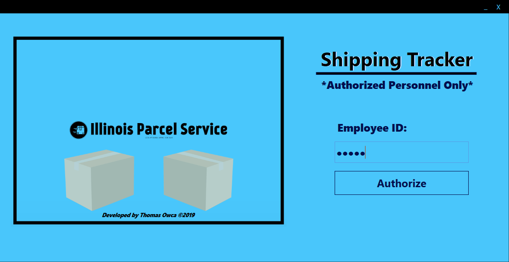

# WPF-Shipment-Tracker
This application connects to MS Access Database. It simulates the tracking of shipments.

****REQUIRED INFORMATION****
For this application to work - it is necessary to modify all occurences of the connectionString variable and modify the Data Source to a directory of your choosing. The Microsoft Access Database file has been provided. It is named Shipments3.mdb.

For logging in purposes, I kept the authorization simple. It uses the Departure Hub Identifier. I recommend logging in with ADA01 or BBB01.

Thanks!

Thomas O.

# APPLICATION IMAGES

