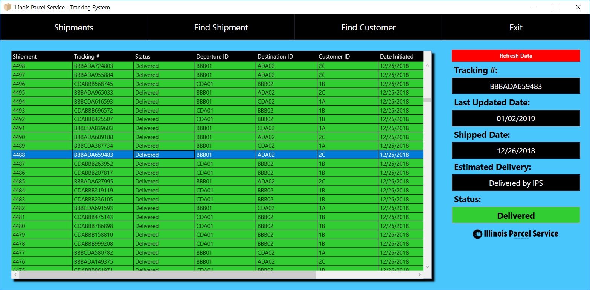

# WPF-Shipment-Tracker
This application connects to MS Access Database. Data fetching is accomplished through the use of various SQL commands. This application simulates the tracking of shipments through method calls that populate new "fictional" shipments. However, this application could readily be converted to track real information in real time as it is connected to a relational database. Using a more robust database such as MS SQL SERVER could prepare such an application to track real information in real time for real purposes. The DataGrid rows are color coded using binding (accomplished through XAML) to each shipment's current status. This should be evident in the pictures of the main shipment tracking page/screen.

****REQUIRED INFORMATION****
For this application to work - it is necessary to modify all occurences of the connectionString variable and modify the Data Source to a directory of your choosing. The Microsoft Access Database file has been provided. It is named Shipments3.mdb.

For logging in purposes, I kept the authorization simple. It uses the Departure Hub Identifier. I recommend logging in with ADA01 or BBB01.

Thanks for looking!

Thomas O.

# APPLICATION IMAGES

